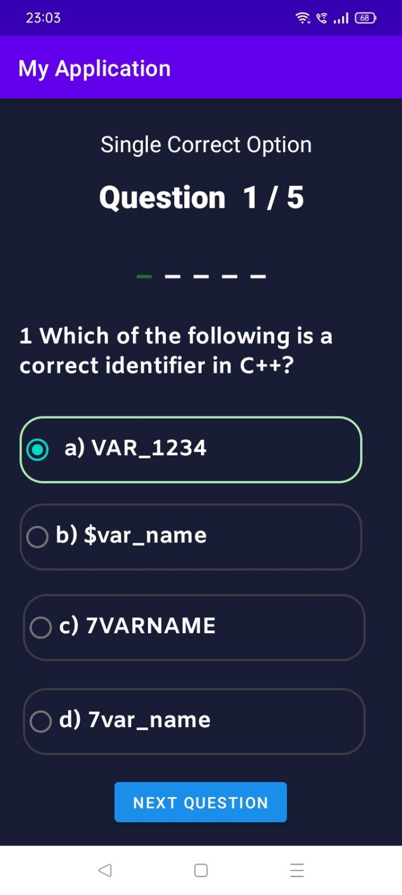
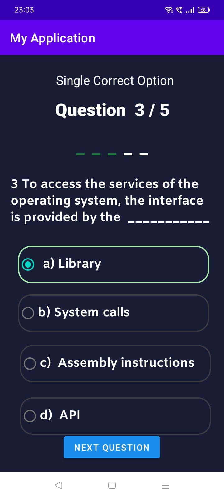
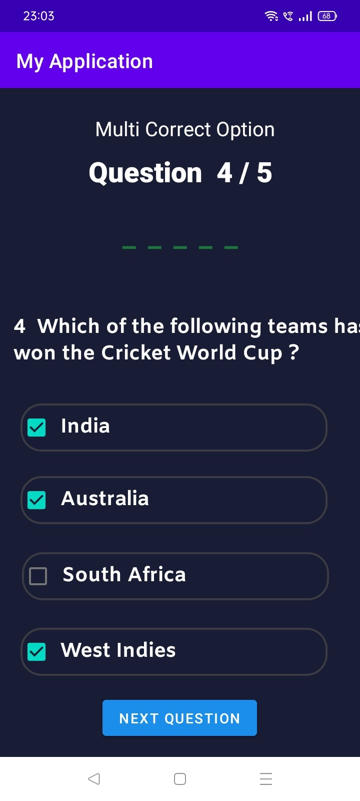

# Quiz_game_app
# Project Title

A small quiz app having 5 questions of every type - Multi correct , single correct and true false questions

## Concepts Used
Used intent concept to create links between different java files 

Also used getExtras and putExtra to send data i.e name and score from one layout to other 
Increment score if option selected is correct
Finally display the name and score 

## Screenshots
1) Home Page 
  
    
     
     
    
2) Question 1 page
     
     
    
     
     
    
3) Question 2 page
     
     
    
     
     
    
4) Question 3 page
     
     
    
     
     

5) Question 4 page
      
    
 
     

6) Question 5 page
     
     
    
   
    
7) Final Page 
  
     
     
    
   
    
